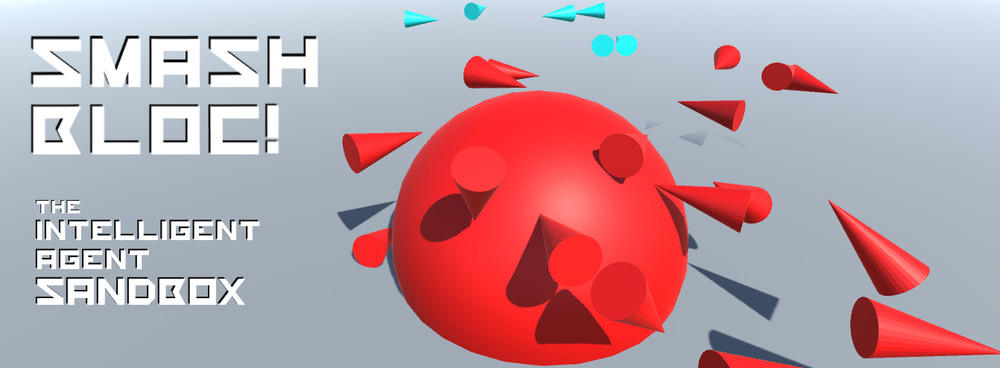

# SmashBloc (v0.0.1.3)

Breaking into AI concepts without formal education on the subject can be tricky, and most universities shutter AI-related courses behind layers of prerequisites. After all, in order to program an effective AI, it's absolutely necessary to have a rigorous understanding of data structures and algorithmic computation.

...Or is it?

SmashBloc is a real-time strategy game programmed in Unity that provides much of the groundwork for constructing an AI that can either control a unit, or control a player. Programming an AI is challenging enough, after all, without needing to build a game around it. While the SmashBloc team works on developing the interactive systems, you're free to experiment and implement your own intelligent agents.

## Prerequisites

SmashBloc is made with Unity, so the Unity editor is required in order to join development. Get Unity [here](https://unity3d.com/).

An executable build is coming soon!

## Getting Started

Clone the repo and open the SmashBloc folder in the Unity editor as an existing project.

At this point you should be able to run it in the editor by clicking the Play button at the top.

## Contributing

Check out [CONTRIBUTING.md](Docs/CONTRIBUTING.md) for more information on contributing to SmashBloc.

## Authors

* **Paul DiSimone** - [PulpyPaul](https://github.com/PulpyPaul)
* **Tory Leo** - [toryjleo](https://github.com/toryjleo)
* **Ben Fairlamb** - [BrokenScience](https://github.com/BrokenScience)
* **Paul Galatic** - [pgalatic](https://github.com/pgalatic)

See also the list of [contributors](https://github.com/RITficialIntelligence/SmashBloc/graphs/contributors) who participated in this project.

## License

See our [license](LICENSE).

## Acknowledgments

This was a project built from the ground up by the Artificial Intelligence club at Rochester Institute of Technology. Check out our [slack](https://ritficialintelligence.slack.com/messages/general/)!
